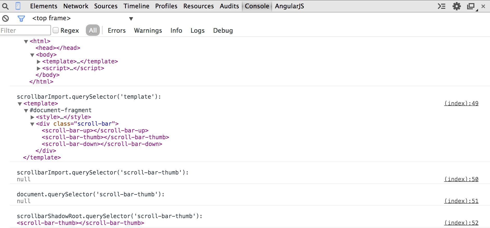

Custom Elements + Shadow DOM (JavaScript Scoping Edition)
==

Shadow DOM provides a way to encapsulate DOM subtrees. Custom elements provide a way to extend the vocabulary of 
HTML adding more appropriate tag names and the ability to attach custom functionally to these new tags. 


Used together, you can now create modular DOM widgets with custom APIs. Very Cool. There are, however, a few things 
that might not be clear from the get-go regarding JavaScript scope and access. I hope this helps clears it up a bit for you. 

First, lets take a quick peek at the rules of encapsulation. 


### Upper Boundary Encapsulation 
Governing the boundary between the shadow root and the shadow host. 

[From the spec](https://dvcs.w3.org/hg/webcomponents/raw-file/ccd579693e46/spec/shadow/index.html#upper-boundary-encapsulation):


* The ownerDocument property refers to the document of the shadow host 
* The nodes and named elements are not accessible using shadow host's document DOM tree accessors or with Window object named properties
* The nodes are not present in any of the document's NodeList, HTMLCollection, or DOMElementMap instances
* The nodes with a unique id and named elements are not addressable from any attributes of elements in shadow host's document
* The style sheets, represented by the nodes are not accessible using shadow host document's CSSOM extensions
* The nodes are accessible using shadow root's DOM tree accessor methods
* The nodes with a unique id and named elements are addressable from any attributes of elements in the same shadow DOM subtree
* The selectors must not cross the shadow boundary from the document tree into the shadow DOM subtree

#### Soooo WTF?

Basically, if you are a shadow root you have access to an exclusive DOM subtree (comprised of you and all of your descendants). 
All styles, classes, ids etc. that are contained in the subtree are in isolation from the rest of the outside DOM. Sooooo if you
have a `<div id="tiger">` in a shadow dom subtree and `<div id="tiger">` outside, the shadow root can query for the internal one 
and outside elements can query for the outer one. Styles can be segregated in a similar fashion. Easy.

**So what about the JavaScript scope?!?**  
There is only **one** document per window. This means that when you import a document via `<link rel="import" href="...">`
you are not adding another document to the window, you must 
[import the nodes](https://developer.mozilla.org/en-US/docs/Web/API/document.importNode) you want before using them. 

But the JavaScript... Right, so, at first glance it may seem that embedding a `<script>` in a `<template>`  
would scope that bit of JavaScript to the imported document and its DOM tree and thus its elements. For example, from the embedded script tag
you might (*mistakenly*) believe that you can query or apply styles to elements within the `<template>`. **This is not the case!**
The script tag, when the `<template>` is appended to a shadow root, gets added to the **global** JavaScript scope 
(remember it was brought in via `importNode`). This is true whether the template was imported or on the initial document. 

This means that the script can't access the `<template>` elements even though it is inside the `<template>` itself!! 

So how can you access the contents programmaticly? When a call is made to `createShadowRoot()` a shadow root element is returned.
**This element can access the shadow DOM via JavaScript**. 
Here is where being able to create custom elements is so cool. Because you
can define the prototype of the custom element, you can encapsulate the creation of the shadow root. The shadow root, created inside a method found on the prototype, can do things like `shadowRoot.querySelector('some-shadow-dom-element')`, or change styling etc. You can choose whether or not to expose the shadow root from your element via basic JavaScript privacy rules (closures). In addition, because a custom element has 
[lifecycle callbacks](http://www.w3.org/TR/custom-elements/#registering-custom-elements), you can, for instance, instantiate the shadow root when the custom element is created, hook up any internal 
encapsulated eventing, and expose a nice API for the cool `<whatever-widget>` you just built. 


## Example Please 

Lets say you have an html page that looks like this
```
<!doctype html>
<html>
	<head>
		<link title="scrollbar" rel="import" href="../components/scrollbar.html">
	</head>
	<body>
		<div class="demo-scroll-surface">
			<scroll-bar></scroll-bar>
		</div>
		<script>
			/* register the custom scroll-bar */
		</script>
	</body>
</html>
```
The link imports this page 
```
<template>
	<style>
		/* local styles */
	</style>
	<div class="scroll-bar">
		<scroll-bar-up></scroll-bar-up>
		<scroll-bar-thumb></scroll-bar-thumb>
		<scroll-bar-down></scroll-bar-down>
	</div>
	<script>
		var scrollBarUp = document.querySelector('scroll-bar-up'); // returns null
	</script>
</template>
```

####Lets create the `<scroll-bar>` custom element.  
First we create an object that will act as a prototype for the new element, the name **must** contain a hyphen (some-name). 
This prototype object extends HTMLElement's prototype. 
This will allow us to inherit tree accessor methods such as querySelector, getElementById, etc. In 
the [createdCallback](http://www.w3.org/TR/custom-elements/#registering-custom-elements) function
we do the heavy lifting. Here we grab a hold of the template via the import, import the node into the 
current document, and after converting the `<scroll-bar>` element to a shadow root, we display the newly imported 
template content node by attaching it to the shadow root. 

After configuring the new `<scroll-bar>` prototype, we make a call to `registerElement` passing in the tag name and prototype.

Kinda like this
```
<script>
	/* register the custom scroll-bar */
	var scrollBarProto = Object.create(HTMLElement.prototype, {
		createdCallback: {
			value: function(){
				// set up the template 
				var scrollbarImport = document.querySelector('link[title="scrollbar"]').import,
					scrollbarTemplate = scrollbarImport.querySelector('template'),
					scrollBarImportClone = document.importNode(scrollbarTemplate.content,true),
					//'this' in this case is the actual scroll-bar DOM element 
					scrollbarShadow = this.createShadowRoot();

				scrollbarShadow.appendChild(scrollBarImportClone);
				console.log(/*see pic below..*/)
			}
		}
	});
	document.registerElement('scroll-bar', {
		prototype: scrollBarProto
	});
</script>
```
####What have we got so far?
A screen shot of a console log form **inside** the createdCallback function sheds a little light. 


####A few things to notice: 

* `document.querySelector('link[title="scrollbar"]').import` is a document 
* From the import, you can query for the `<template>` 
* The `<template>` contains a `#document-fragment` this is shadow DOM, only reachable from within the shadow dom tree
* Querying for any dom element within the `#document-fragment` such as the `<scroll-bar-thumb>` element from the document it was imported from will return null
* Querying for shadow DOM elements from the root document or anywhere else besides the shadow root (or within the shadow tree) will return null
* The shadow root can query the shadow DOM for elements


###What about that custom API you mentioned? 
Lets go back to the `scrollBarProto` and add a custom method, well call it demoMethod

```
<script>
	/* register the custom scroll-bar */
	var scrollBarProto = Object.create(HTMLElement.prototype, {
		createdCallback: {
			value: function(){
				...
			}
		},
		demoMethod: {
			value: function(){
				console.log('I\'m a custom method and my `this` is the actual scroll-bar element %o', this);
			}
		}
	});
</script>
```
We can get a hold of the custom `<scroll-bar>` from the document. Note that the outer `<scroll-bar>` element is selectable
as an element in the documnet even though it is a shadow root, its contents, however, are shadow DOM and are not.
Lets have a look at a few more screen shots to see whats going on here. In the first one we let the Chrome dev
tools auto-complete some available attributes and methods on the `<scroll-bar>`. In the second console screen shot 
we see the result of running our `demoMethod`.

####Whats available 


####What the this is 


####A few things to notice 

* `demoMethod` is there on the element alongside the other inherited methods
* Running our `demeMethod` gives us the element itself as the `this`
* You can add methods to the custom element's prototype and treat them like an API 

###Hope it helped
Questions? Comments? Bugs? Thats what the comments are for amigos.


